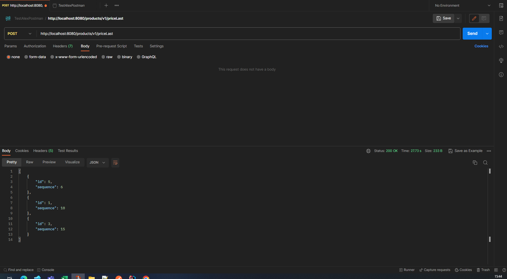
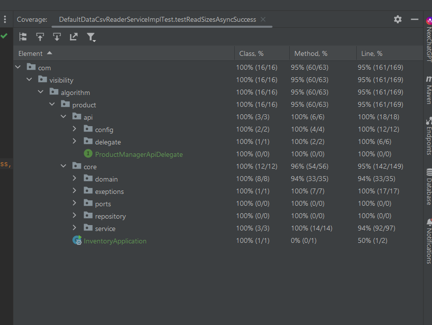

# Summary of the practice


# Exercise
# Algoritmo de Visibilidad

La visibilidad de los productos en una tienda en línea es crucial. Cuando se presenta una serie de productos en una plataforma de comercio electrónico, es esencial filtrar aquellos productos que se han quedado sin stock para facilitar al usuario la tarea de encontrar productos disponibles para compra. A continuación, presentamos un algoritmo que aborda este desafío.

Especificaciones

Si todas las tallas de un producto no tienen stock, el producto no debe mostrarse.
Casuísticas especiales:
Si una talla está marcada como 'back soon', aunque no tenga stock, el producto debe mostrarse, ya que volverá a estar disponible próximamente.
Un producto con tallas "especiales" solo será visible si al menos una talla especial y una no especial tienen stock (o están marcadas como 'back soon'). Si solo tallas de un tipo (especial o no especial) tienen stock o están marcadas como 'back soon', el producto no debe mostrarse.
Entrada de datos

Se deben leer tres archivos CSV:

product.csv: Contiene campos id (identificador de producto) y sequence (posición del producto).
size.csv: Contiene campos id (identificador de talla), productId (identificador de producto), backSoon (indica si la talla volverá pronto) y special (indica si la talla es especial).
stock.csv: Contiene campos sizeId (identificador de talla) y quantity (cantidad de stock).
Salida

La salida será una lista de identificadores de productos que cumplen las condiciones de visibilidad, ordenados por el campo sequence.

Estructuras de datos utilizadas en el algoritmo

Listas (List): Usadas para almacenar y procesar productos, tallas y stocks. Son ideales cuando necesitamos mantener el orden de los elementos y tener acceso indexado.

Mapas (Map): Usados para agrupar tallas por producto y para almacenar el stock por talla. Permiten búsquedas rápidas por clave y son útiles para representar relaciones entre dos tipos de datos. En este código, primero generamos los mapas para las tallas y stocks para poder realizar búsquedas eficientes. Luego, recorremos cada producto y sus tallas respectivas. Para cada talla, comprobamos si tiene stock o si está marcada como "back soon". Si se cumple alguna de estas condiciones, marcamos que el producto tiene stock. Además, si la talla es "especial", marcamos que el producto tiene stock especial, y si no es "especial", marcamos que el producto tiene stock regular. Una vez que hemos comprobado todas las tallas para un producto, verificamos las condiciones de visibilidad. Si el producto tiene stock y no es un producto compuesto, o si es un producto compuesto y tiene tanto stock especial como regular, lo agregamos a la lista de productos visibles. Finalmente, ordenamos los productos visibles por su secuencia y los devolvemos.

Complejidad temporal del algoritmo

El algoritmo presentado tiene una complejidad temporal de aproximadamente O(n) para la lectura de los archivos CSV y O(n) para el procesamiento de la visibilidad de los productos, siendo n el número de productos. Sin embargo, el uso de mapas para almacenar relaciones puede añadir cierta complejidad dependiendo del número de relaciones.

La complejidad total puede considerarse O(n) ya que las operaciones dentro de los bucles son constantes y no dependen del tamaño de los datos de entrada.

En el código del algoritmo de visibilidad, se utilizan varias estructuras de datos, cada una de ellas seleccionada por su utilidad y eficiencia en la solución del problema. A continuación, se detalla cada una de estas estructuras de datos y por qué se han seleccionado:

Listas (List): Las listas se utilizan para almacenar los objetos de productos, tallas y existencias. Estos objetos representan las filas de los archivos CSV o las tablas de la base de datos, dependiendo del caso. Se eligió la lista porque necesitábamos una estructura de datos que nos permitiera almacenar una colección de elementos, y necesitábamos acceder a cada elemento de manera secuencial, lo cual es una característica principal de las listas.

Mapas (Map): Los mapas se utilizan para agrupar las tallas por producto y para asociar cada talla con su cantidad en existencia. Esto facilita la búsqueda de tallas por producto y la obtención de la cantidad de una talla específica. Los mapas son ideales para estas tareas debido a su eficiencia en la búsqueda (la complejidad de tiempo de búsqueda es O(1)) y a su capacidad para asociar una clave con un valor, lo cual es perfecto para nuestros propósitos.

Listas de nuevo (List): Finalmente, se utiliza otra lista para almacenar los productos visibles que cumplen con las condiciones de visibilidad. Esta lista se utiliza para almacenar los productos que pasarán a la siguiente etapa del procesamiento (por ejemplo, la visualización al usuario o la persistencia en la base de datos).

Es importante mencionar que la elección de estas estructuras de datos está muy influenciada por las características del problema. Dependiendo del caso, otras estructuras de datos podrían haber sido más apropiadas. Sin embargo, en este contexto específico, las listas y los mapas son muy eficientes y satisfacen nuestras necesidades.

Mejoras potenciales

Uso de bases de datos: En lugar de leer archivos CSV, el algoritmo podría beneficiarse de una base de datos con indexación adecuada para mejorar las consultas.

Paralelismo: Dado que cada producto es independiente de los demás, podríamos procesar la visibilidad de múltiples productos en paralelo utilizando técnicas de programación concurrente.

Producto 1:

Tallas y su stock:<br>
11 (back soon, no especial) - 0 unidades<br>
12 (no back soon, no especial) - 0 unidades<br>
13 (back soon, no especial) - 0 unidades<br>

Evaluación:
Aunque no tiene stock, tiene tallas marcadas como "back soon", así que el producto es visible.

Producto 2:

Tallas y su stock:<br>
21 (no back soon, no especial) - 0 unidades<br>
22 (no back soon, no especial) - 0 unidades<br>
23 (back soon, especial) - 0 unidades<br>

Evaluación:
No tiene stock en ninguna talla.
Una talla especial está marcada como "back soon", pero no tiene una talla no especial con stock o marcada como "back soon", por lo que el producto no es visible.
Producto 3:

Tallas y su stock:<br>
31 (back soon, no especial) - 10 unidades<br>
32 (back soon, no especial) - 10 unidades<br>
33 (no back soon, no especial) - 10 unidades<br>

Evaluación:
Todas las tallas tienen stock y, por lo tanto, el producto es visible.
Producto 4:

Tallas y su stock:<br>
41 (no back soon, no especial) - 0 unidades<br>
42 (no back soon, no especial) - 0 unidades<br>
43 (no back soon, no especial) - 0 unidades<br>
44 (back soon, especial) - 10 unidades<br>

Evaluación:
Solo la talla especial tiene stock, pero no hay una talla no especial con stock o marcada como "back soon", por lo que el producto no es visible.
Producto 5:

Tallas y su stock:<br>
51 (back soon, no especial) - 10 unidades<br>
52 (no back soon, no especial) - 10 unidades<br>
53 (no back soon, no especial) - 10 unidades<br>
54 (back soon, especial) - 10 unidades<br>

Evaluación:
Todas las tallas tienen stock y hay al menos una talla especial y una no especial con stock, por lo que el producto es visible.
Dado el análisis anterior, los productos visibles son 1, 3 y 5.


Conclusión

El algoritmo de visibilidad es esencial para mejorar la experiencia del usuario en tiendas en línea, al mostrar solo aquellos productos que están disponibles o que volverán a estarlo próximamente. La elección adecuada de estructuras de datos y una consideración cuidadosa de la complejidad son cruciales para garantizar un rendimiento eficiente.


# postman

[TestAlexPostman.postman_collection.json](postman/TestAlexPostman.postman_collection.json)

# specs
[openapi.yaml](specs%2Fopenapi.yaml)

# Coverage


###  Build and Run application
[]()
_GOTO >_ **~/absolute-path-to-directory/inventory**  
and try below command in terminal
> **```mvn spring-boot:run```** it will run application as spring boot application


or
> **```mvn clean install```** it will build application and create **jar** file under target directory

Run jar file from below path with given command
> **```java -jar ~/path-to-inventory/target/inventory-0.0.1-SNAPSHOT.jar```**


